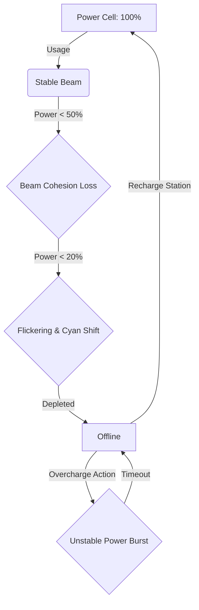
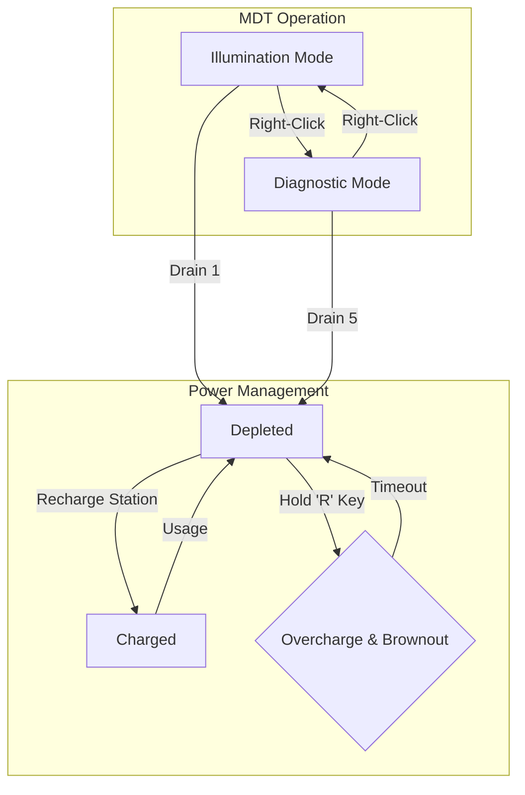

# Multi-Spectrum Diagnostic Tool: Design Document

## 1. Overview

This document outlines the redesign of the standard-issue flashlight into a **Multi-Spectrum Diagnostic Tool (MDT)**. The MDT is the primary instrument for reclamation technicians tasked with restarting the dormant, planetary-scale machine. Its purpose is to diagnose system failures, analyze esoteric energy fluctuations, and interact with the machine's arcane components. The core gameplay loop is not survival, but methodical analysis, resource management, and repair.

---

## 2. Phase 1: Audio-Visual Fidelity

This phase focuses on establishing the MDT as a piece of advanced, powerful, yet potentially unstable technology.

### 2.1. Multi-Spectrum Beam

The standard light cone is replaced with a controlled, multi-layered energy beam.

*   **Implementation:** The `THREE.SpotLight` will be augmented with custom shaders and secondary light sources to create a distinct visual language for each mode.
*   **Visuals:** The beam will have a clean, high-tech appearance. A bright, stable central beam with a softer, wider corona. Lens flare effects and subtle chromatic aberration at the edges will signify its power.
*   **Audio:** The MDT will emit a low, steady hum when in Illumination Mode. Switching to Diagnostic Mode will produce a distinct "power-up" sound, and the hum will increase in pitch and complexity, with subtle clicks and whirs suggesting complex internal processes.

### 2.2. Power Cell & Fluctuation Effects

The MDT is powered by a high-capacity power cell that must be recharged at designated stations. Its performance is tied directly to its power level.

*   **Power Drain:** The power cell drains based on the active mode.
*   **Visual Feedback:** As power depletes, the beam's cohesion will degrade. The edges will become less defined, and subtle energy artifacts will flicker across the beam.
*   **Color Shift:** At full power, the beam is a pure, neutral white. As power drains, it shifts towards a cyan hue, indicating a drop in energy efficiency.

### 2.3. Visual State Diagram

---

## 3. Phase 2: Core Mechanics & Resource Management

This phase defines the MDT's primary functions and the resource management loop that drives gameplay.

### 3.1. Dual-Mode Operation

The technician can switch between two primary operational modes (`Right-Click`).

*   **Illumination Mode:** A wide-angle, energy-efficient beam for navigating the structure. Provides clear, simple light. (Power Drain: 1x)
*   **Diagnostic Mode:** A focused, high-intensity beam that consumes significant power. This mode is the core of the gameplay and is used to:
    *   **Reveal Data Streams:** Renders invisible, corrupted data patterns on surfaces, allowing the technician to trace system failures.
    *   **Energize Components:** Supplies direct energy to dead conduits, terminals, or small mechanisms to temporarily reactivate them.
    *   **Scan for Anomalies:** Highlights temporal or spatial distortions, structural weaknesses, or energy leaks as glowing particulates or heat-haze effects within the beam.
    (Power Drain: 5x)

### 3.2. The "Overcharge" Mechanic

When the power cell is depleted, the technician can perform an emergency power reroute.

*   **Input:** A deliberate, held key press (e.g., hold 'R') to initiate the overcharge sequence.
*   **Outcome:** A brief (2-3 second) burst of maximum-intensity power in the currently selected mode. This allows for a last-ditch scan or component activation.
*   **Risk:** The overcharge creates a significant power surge, causing a localized system brownout. Lights in the area will flicker and die, and any nearby active systems may temporarily fail. The sound is a sharp electrical crackle and a deep hum, indicating the strain on the equipment. This is a calculated risk to be used in critical situations.

### 3.3. Mechanic State Diagram

---

## 4. Phase 3: Gameplay Integration

This phase integrates the MDT's functions with the environment to create procedural challenges.

### 4.1. System Diagnostics & Repair

The core loop will involve using the MDT to solve cascading system failures.

*   **Example Workflow:**
    1.  A primary system is offline. The technician finds a terminal indicating a power failure.
    2.  Using **Diagnostic Mode**, the technician follows a corrupted data conduit (visible only in this mode) along the wall to a damaged junction box.
    3.  The junction box requires power to be reset. The technician uses the **Diagnostic Mode** beam to energize the junction's receiver.
    4.  The junction resets, but reveals a structural weakness in the wall behind it (visible via the anomaly scan). The primary system remains offline.
    5.  The technician must find a way to reinforce the structure before proceeding.

### 4.2. Environmental Puzzles

The environment itself is the puzzle. The MDT is the key.

*   **Temporal Fractures:** Small, localized time loops that can only be seen and "welded" shut with a sustained blast from the **Diagnostic Mode** beam.
*   **Paradoxical Schematics:** Schematics that appear blank or corrupted until viewed in **Diagnostic Mode**, revealing the true instructions.
*   **Resonant Frequency Locks:** Mechanisms that only activate when exposed to the specific energy frequency of the **Diagnostic Mode** beam for a set duration.

---

## 5. Implementation Plan

The implementation will begin by overhauling the `flashlight` object in `js/state.js` to reflect the new MDT properties (mode, powerCell, etc.). The `updateFlashlight` function in `js/gameLoop.js` and the input handlers in `js/controls.js` will be rewritten to manage the new mode-switching, overcharge, and power drain logic. New audio functions will be added to `js/audio.js` for the MDT's operational sounds.