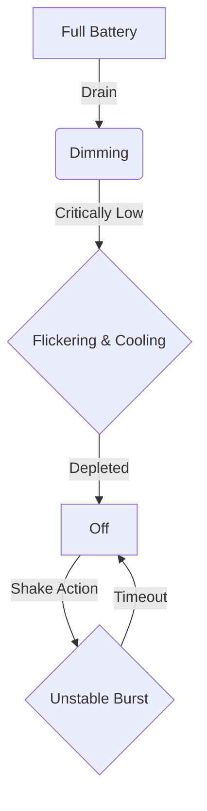
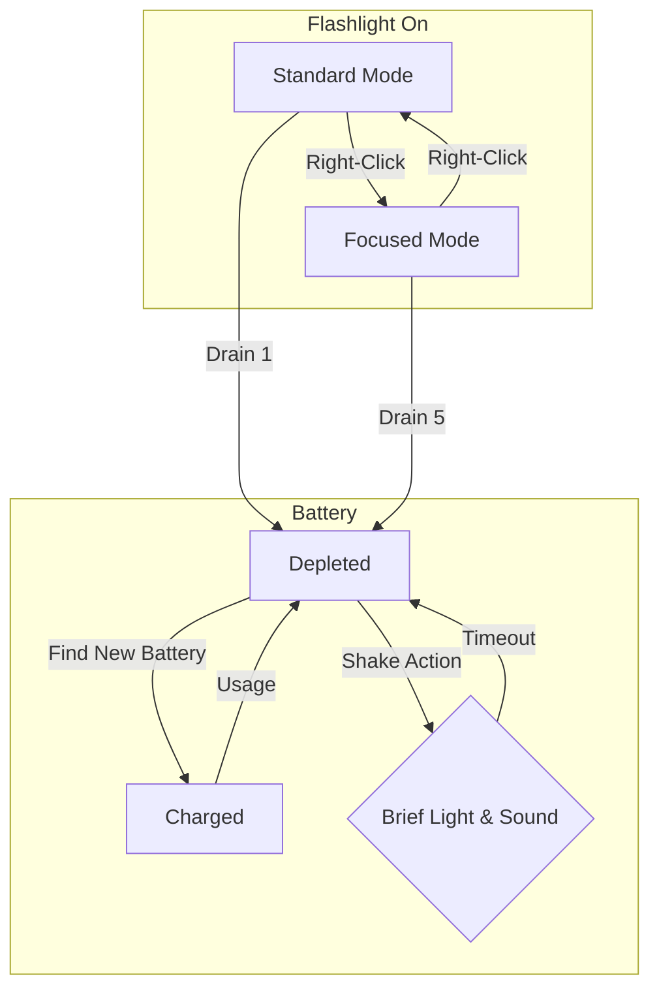

# Flashlight Redesign: Technical Design Document

## 1. Overview

This document outlines the comprehensive redesign of the flashlight mechanic for the survival horror game. The goal is to transform the flashlight from a simple light source into a central pillar of the gameplay experience, enhancing immersion, strategic depth, and tension.

---

## 2. Phase 1: Visual Fidelity & Immersion

This phase focuses on making the flashlight feel like a tangible, unreliable object in the game world.

### 2.1. Volumetric Beam

The static light cone will be replaced with a dynamic, volumetric beam.

*   **Implementation:** We will replace the current `THREE.SpotLight` with a more advanced setup. This will likely involve a custom shader or a combination of multiple lights.
*   **Hotspot & Spill:** The light will consist of two components:
    *   A bright, focused **hotspot** at the center of the beam, used for detailed examination and puzzle-solving.
    *   A wider, softer **spill** that illuminates the immediate surroundings, providing peripheral vision.
*   **Dynamic Shadows:** The flashlight will cast soft-edged, dynamic shadows, adding realism and creating opportunities for enemies to hide just outside the main beam. We will leverage Three.js's `PCFSoftShadowMap`.
*   **Dust Particles:** A particle system will be implemented to render dust motes and other particulates in the air, which will only be visible when illuminated by the flashlight beam, enhancing the volumetric effect.

### 2.2. Battery Depletion Effects

As the battery drains, the light's quality will degrade, providing clear visual feedback to the player.

*   **Dimming:** The light's intensity will decrease non-linearly as the battery level drops.
*   **Flickering:** At critical battery levels (e.g., < 20%), the light will begin to flicker erratically. This will be controlled by a timer in the `updateFlashlight` loop.
*   **Color Temperature:** The light's color will shift from a warm white (full battery) to a cooler, bluish-white as the battery dies, simulating a real incandescent bulb's failure. This will be achieved by interpolating the light's color property.

### 2.3. Visual State Diagram

---

## 3. Phase 2: Resource Management & Tension

This phase introduces new mechanics to make battery management a constant source of tension.

### 3.1. Dual-Mode Operation

The player can switch between two modes, managed via a new key input (e.g., `Right-Click`).

*   **Standard Mode:** A wide, low-intensity beam for general navigation. Consumes battery at a baseline rate (1x).
*   **Focused Mode:** A narrow, high-intensity beam. Required for stunning specific enemies and solving puzzles. Consumes battery at a significantly higher rate (e.g., 3x-5x).

### 3.2. The "Shake" Mechanic

When a battery is depleted, the player has a high-risk, high-reward option.

*   **Input:** A frantic, repeatable player action (e.g., rapidly pressing the 'F' key).
*   **Outcome:** Each successful "shake" provides a brief (1-2 seconds) burst of unstable, flickering light.
*   **Risk:** The shake action generates a distinct sound with a specific radius. This sound will be audible to nearby hostile AI, potentially revealing the player's position.

### 3.3. Resource Scarcity

Batteries will be a scarce resource found throughout the asylum, forcing the player to conserve power and make strategic decisions about when to use the flashlight.

### 3.4. Mechanic State Diagram

---

## 4. Phase 3: Gameplay Integration & Strategic Depth

This phase integrates the new flashlight mechanics directly with enemy AI and level design.

### 4.1. Enemy Interaction

*   **Photophobic Enemies:** Certain enemy types will be sensitive to light.
    *   The **Focused Beam** will temporarily stun or repel them, turning the flashlight into a defensive tool.
    *   The **Standard Beam** will have a lesser effect or no effect at all.
*   **Apex Predators:** More formidable creatures will be attracted to the light source from a distance. This creates a risk-reward dynamic: using the light to see makes the player a target.

### 4.2. Environmental Puzzles

*   The **Focused Beam** will be required to solve specific puzzles.
    *   **Revealing Symbols:** Hidden messages, symbols, or diagrams painted with a special material that is only visible under intense, direct light.
    *   **Activating Sensors:** Light-sensitive switches or mechanisms that must be activated from a distance.

---

## 5. Implementation Plan

The implementation will proceed in the order of the phases outlined above. We will start by modifying the `flashlight` object in `js/state.js` to include the new properties (mode, color, etc.) and then overhaul the `updateFlashlight` function in `js/gameLoop.js` and the `toggleFlashlight` function in `js/controls.js` to handle the new logic. New audio assets for the "shake" mechanic will be created and integrated via `js/audio.js`.

Once the plan is approved, we will switch to **Code Mode** to begin implementation.