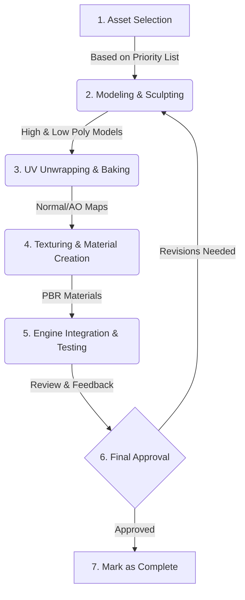

# Visual Overhaul Strategy: "The Desert Looks Back"

## 1. Core Art Direction: Gritty Realism with Surrealist Interruptions

This direction aims to ground the player in a believable, tangible world that is then systematically undermined by surreal, psychologically jarring events. The mundane becomes menacing.

*   **Aesthetic:** Photorealistic, but slightly stylized. We will aim for a look that feels like a forgotten photograph or a worn VHS tape. The world should feel lived-in, dusty, and neglected.
*   **Mood:** Oppressive, lonely, and tense, with moments of intense, surreal dread. The atmosphere should feel heavy, as if reality itself is thin and on the verge of breaking.
*   **Color Palette:**
    *   **Primary (Reality):** Desaturated, earthy tones. Sun-bleached desert colors, faded asphalt, dusty browns, and the washed-out pastels of a lonely diner.
    *   **Secondary (Surreal):** Intrusive, highly saturated colors that signal a break from reality. Deep, velvety reds (like the Red Room), sickly yellows, and harsh, artificial blues and magentas.
*   **Key Visual References:**
    *   **Cinema:** David Lynch's *Twin Peaks* (especially the Black Lodge sequences) and *Lost Highway*. The desolate landscapes of *Paris, Texas*. The gritty, oppressive atmosphere of *Se7en*.
    *   **Photography:** The work of Gregory Crewdson (staged, cinematic suburban scenes), Todd Hido (lonely, nocturnal landscapes), and Stephen Shore (mundane American scenes).

---

## 2. Technical Budgets & Constraints

To ensure optimal performance on target platforms, we will adhere to the following technical budgets. These are initial estimates and may be refined.

*   **Characters:**
    *   **Player/Key NPCs:** 20k-30k polygons.
    *   **Enemies/Environmental Characters:** 10k-15k polygons.
    *   **Textures:** 2k resolution for main textures (albedo, normal, roughness), 1k for smaller details.
*   **Environments:**
    *   **Memory:** Strict budgets per scene to manage texture and geometry streaming.
    *   **Shaders:** Favor efficient, high-impact shaders for lighting and atmospheric effects over overly complex material shaders. We will leverage the new flashlight design's volumetric lighting to carry much of the visual weight.
*   **Props:**
    *   **High-Interaction Props:** 2k-5k polygons, 1k textures.
    *   **Background Props:** 500-1.5k polygons, 512px textures.

---

This document will be updated as we complete each phase.

---

## 3. Asset Enhancement Strategy

This section details the specific visual and technical enhancements for each major asset category, aligned with the core art direction.

### 3.1. Characters
Characters must be believable and subtly unsettling. The goal is to make them feel grounded in reality, but with something "off" about them.

*   **Modeling:**
    *   Increase polygon counts to allow for more detailed silhouettes and subtle facial expressions.
    *   Focus on imperfections: asymmetrical features, slight blemishes, and worn clothing.
*   **Texturing & Materials:**
    *   Utilize PBR (Physically Based Rendering) materials for realistic skin, fabric, and hair.
    *   Textures will be high-resolution (2k), capturing fine details like pores, wrinkles, and fabric weaves.
    *   Subsurface scattering will be used for skin to enhance realism under different lighting conditions.

### 3.2. Environments
The environment is a character in itself. It must tell a story of neglect and decay, and serve as a canvas for the surreal interruptions.

*   **Lighting & Atmosphere:**
    *   The primary focus will be on realistic, dynamic lighting, leveraging the redesigned flashlight.
    *   We will use volumetric fog and dust particles to create a thick, heavy atmosphere.
    *   Light sources will be used to create pools of oppressive darkness and stark, high-contrast areas.
*   **Architecture & Foliage:**
    *   Increase geometric detail in architectural elements (e.g., worn edges, cracked walls, peeling paint).
    *   Foliage will be sparse but detailed, consisting of dead or dying desert plants.

### 3.3. Props
Props are key to environmental storytelling. They must feel tangible and consistent with the world's aesthetic.

*   **Modeling & Texturing:**
    *   High-priority interactive props will be modeled with significant detail.
    *   All props will receive a "wear and tear" pass, with textures showing dust, grime, scratches, and rust.
    *   Ensure material definitions (e.g., metal, wood, plastic) are accurate and react convincingly to light.

### 3.4. UI/UX
The UI should be minimal, diegetic (integrated into the game world where possible), and stylistically aligned with the game's gritty, analog feel.

*   **Redesign:**
    *   Replace clean, vector-based UI elements with designs that feel like they belong on old CRT monitors, faded paper, or worn-out equipment.
    *   Interaction prompts will be subtle and integrated into the environment.
    *   The color palette will be muted, using amber or green monochrome text on dark backgrounds, avoiding bright, distracting colors unless it's a deliberate part of a surreal event.

---

## 4. Production & Implementation Pipeline

This section outlines a prioritized, phased approach to the asset overhaul. The goal is to focus on high-impact changes first to quickly establish the new visual benchmark.

### 4.1. Asset Rework Prioritization

Assets will be reworked in the following order to maximize visual impact early in the process:

1.  **Core Environmental Assets:**
    *   **Target:** Diner, Gas Station, and the desert road itself.
    *   **Reasoning:** These form the game's primary setting. Overhauling them first will immediately establish the new art direction and atmosphere. This includes key architectural pieces, ground textures, and large-scale environmental props.
2.  **Key Interactive Props & UI:**
    *   **Target:** The Jukebox, Owl Cave Coin, and the core UI elements.
    *   **Reasoning:** These are central to the main narrative path and player interaction. Their visual fidelity is crucial for player immersion.
3.  **Primary Characters & Entities:**
    *   **Target:** The Player's hands/body, the "Man from Another Place" entity, and the cat.
    *   **Reasoning:** These characters are central to the narrative and player experience.
4.  **Secondary & Background Assets:**
    *   **Target:** Environmental props with low interactivity, distant scenery, etc.
    *   **Reasoning:** These assets complete the scene but have a lower immediate impact on gameplay.

### 4.2. Asset Workflow

Each asset will move through the following standardized pipeline:

